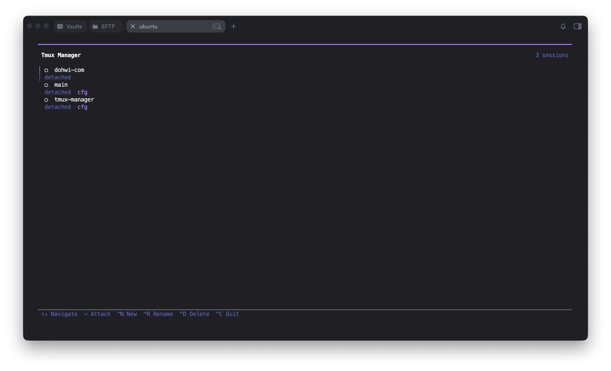

<div align="center">

# tmux-manager

**A Dracula-themed TUI for tmux session management**

Create, switch, and kill sessions with `tm`. Define your workspace in YAML and restore it on reboot.

</div>

---

## ✨ Features

- **TUI session management** — `↑↓` navigate, `Enter` attach, `Ctrl+N/D/R` operate
- **YAML workspaces** — define session, window, and pane layouts as code
- **Auto-restore** — `tm restore` brings your workspace back after reboot
- **cfg tag** — YAML-managed sessions are tagged `cfg` in the TUI
- **Dracula theme** — developer-friendly color scheme

---

## 📸 Screenshot



---

## 📦 Installation

```bash
git clone https://github.com/dohwi/tmux-manager.git
cd tmux-manager
go build -o tmux-manager .
./tmux-manager setup
```

`setup` handles everything automatically:

| Item | Description |
|------|-------------|
| `~/.local/bin/tm` | Create symlink |
| `~/.zshrc` | Register `nocorrect tm` alias |
| `~/.profile` | Register `tm restore` for auto-restore on boot |
| `~/.config/tmux-manager/sessions/` | Create config directory |

To update, just rebuild — the symlink automatically points to the latest binary.

```bash
go build -o tmux-manager .
```

---

## 🚀 Usage

```bash
tm          # Launch TUI
tm restore  # Restore sessions from config
```

### Keybindings

| Key | Action |
|:----|:-------|
| `↑` `↓` `j` `k` | Navigate sessions |
| `Enter` | Attach to session |
| `Ctrl+N` | Create new session |
| `Ctrl+R` | Rename selected session |
| `Ctrl+D` | Delete selected session |
| `Ctrl+C` | Quit |

---

## ⚙️ Configuration

`~/.config/tmux-manager/sessions/*.yaml`

### Minimal — single pane

```yaml
sessions:
  - name: monitoring
    panes:
      - command: htop
```

### Side-by-side split

```yaml
sessions:
  - name: dev
    panes:
      - command: nvim
        directory: ~/projects/myapp
      - command: lazygit
        direction: right
        directory: ~/projects/myapp
```

```
┌────────────┬──────────┐
│    nvim    │ lazygit  │
└────────────┴──────────┘
```

### Complex layout

```yaml
sessions:
  - name: dev
    panes:
      - command: nvim
        directory: ~/projects/myapp
      - command: lazygit
        direction: right
        directory: ~/projects/myapp
      - command: npm run dev
        direction: down
        directory: ~/projects/myapp
```

```
┌────────────┬──────────┐
│            │ lazygit  │
│    nvim    ├──────────┤
│            │ npm run  │
│            │   dev    │
└────────────┴──────────┘
```

### Multi-window

```yaml
sessions:
  - name: myapp
    windows:
      - name: code
        directory: ~/projects/myapp
        panes:
          - command: nvim
          - command: lazygit
            direction: right
      - name: infra
        directory: ~/projects/myapp
        panes:
          - command: docker-compose up
          - command: docker logs -f
            direction: down
```

### Multiple sessions in one file

```yaml
sessions:
  - name: dev
    panes:
      - command: opencode
        directory: ~/projects/myapp
      - command: lazygit
        direction: right
        directory: ~/projects/myapp

  - name: db
    panes:
      - command: psql myapp
        directory: ~/projects/myapp
```

---

## 📋 Field Reference

| Field | Required | Description |
|:------|:--------:|:------------|
| `sessions` | ✅ | Session definition array |
| `sessions[].name` | ✅ | tmux session name |
| `sessions[].windows` | | Window list |
| `sessions[].windows[].name` | | Window tab name (defaults if omitted) |
| `sessions[].windows[].directory` | | Working directory for the window (`~/` supported) |
| `sessions[].windows[].command` | | Command for a single-pane window |
| `sessions[].windows[].panes` | | Pane layout within the window |
| `sessions[].panes` | | Pane layout for the default window |
| `panes[].command` | | Command to run in the pane |
| `panes[].directory` | | Working directory for the pane (`~/` supported) |
| `panes[].name` | | Pane title (sets tmux pane title) |
| `panes[].direction` | | Split direction: `right` · `down` (omit for first pane) |

---

## 🔄 Auto-Restore

`tm setup` adds this to `~/.profile`:

```bash
tm restore 2>/dev/null
```

After a reboot, SSH login automatically creates sessions defined in your YAML files. Existing sessions are skipped (idempotent).

---

## 🎨 cfg Tag

Sessions managed via YAML are distinguished in the TUI with a `cfg` tag:

```
◉  good-giraffe-drawing    attached    cfg
○  myapp-dev               1 windows   cfg
●  temp-session             attached
```

---

<div align="center">

**tmux-manager** — manage sessions, not commands.

</div>