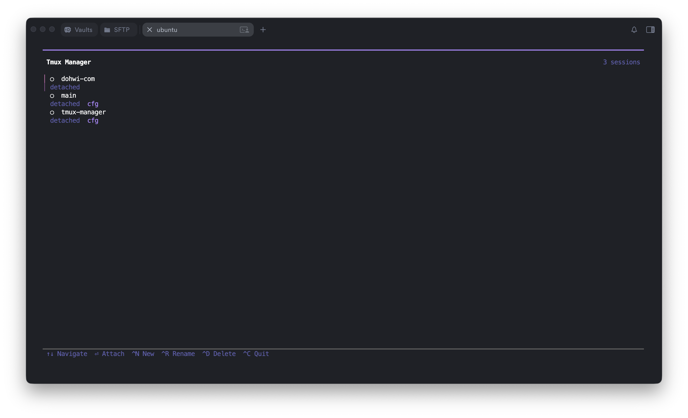

<div align="center">
  <h1>tmux-manager</h1>
  <p>TUI session manager for tmux — define workspaces in YAML, restore on reboot</p>

  <p>
    
    
    
    
  </p>
</div>

---

## Features

- 🎯 **Keyboard-driven TUI** — browse, create, and kill sessions in seconds
- 📄 **YAML workspaces** — define sessions, windows, and pane layouts as code
- 🔄 **Auto-restore** — `tm restore` brings your workspace back after reboot
- 🏷️ **cfg tag** — visually distinguish YAML-managed sessions from manual ones
- 🎨 **Catppuccin Mocha theme** — soft pastel status bar, easy on the eyes
- ⚡ **One-command install** — Go, tmux, shell integration, all set up automatically

---

## 📸 Screenshot



---

## 🚀 Quick Start

```bash
curl -fsSL https://raw.githubusercontent.com/dohwi/tmux-manager/main/install.sh | bash
```

That's it. This command:

1. Installs Go (if missing)
2. Builds `tmux-manager` from the latest release
3. Runs `tm setup` — installs tmux (if missing), configures shell integration, status bar, and auto-restore

After installation, just run `tm` in a new terminal.

---

## 📦 Commands

```bash
tm                    # Launch TUI
tm restore            # Restore sessions from YAML
tm restore --dry-run  # Preview what would be restored
tm setup              # Install symlink and shell integration
tm setup --uninstall  # Remove all integration
tm update             # Update to the latest release
tm update --check     # Check for updates without installing
tm version            # Print version
```

### ⌨️ Keybindings

| Key | Action |
|:---:|:-------|
| `↑` `↓` `j` `k` | Navigate sessions |
| `Enter` | Attach to session |
| `Ctrl+N` | Create new session |
| `Ctrl+R` | Rename session |
| `Ctrl+D` | Delete session |
| `Ctrl+C` | Quit |

---

## ⚙️ Configuration

Workspace definitions go in `~/.config/tmux-manager/sessions/*.yaml`.

### Single pane

```yaml
sessions:
  monitoring:
    windows:
      - panes:
          - command: htop
```

### Side-by-side

```yaml
sessions:
  dev:
    windows:
      - panes:
          - command: nvim
            directory: ~/projects/myapp
          - command: lazygit
            direction: right
            directory: ~/projects/myapp
```

```
┌────────────┬──────────┐
│    nvim    │ lazygit  │
└────────────┴──────────┘
```

### Complex layout

```yaml
sessions:
  dev:
    windows:
      - panes:
          - command: nvim
            directory: ~/projects/myapp
          - command: lazygit
            direction: right
            directory: ~/projects/myapp
          - command: npm run dev
            direction: down
            directory: ~/projects/myapp
```

```
┌────────────┬──────────┐
│            │ lazygit  │
│    nvim    ├──────────┤
│            │ npm run  │
│            │   dev    │
└────────────┴──────────┘
```

### Multi-window

```yaml
sessions:
  myapp:
    windows:
      - name: code
        panes:
          - command: nvim
            directory: ~/projects/myapp
          - command: lazygit
            direction: right
            directory: ~/projects/myapp
      - name: infra
        panes:
          - command: docker-compose up
            directory: ~/projects/myapp
          - command: docker logs -f
            direction: down
            directory: ~/projects/myapp
```

### Multiple sessions

```yaml
sessions:
  dev:
    windows:
      - panes:
          - command: nvim
            directory: ~/projects/myapp
          - command: lazygit
            direction: right

  db:
    windows:
      - panes:
          - command: psql myapp
            directory: ~/projects/myapp
```

### Field Reference

| Field | Required | Description |
|:------|:--------:|:------------|
| `sessions` | ✅ | Map of session names to window definitions |
| `sessions[].windows` | | Window list (default: one empty window) |
| `sessions[].windows[].name` | | Window tab name |
| `sessions[].windows[].panes` | | Pane layout within the window |
| `panes[].command` | | Command to run in the pane |
| `panes[].directory` | | Working directory (`~/` supported) |
| `panes[].name` | | Pane title |
| `panes[].direction` | | Split direction: `right` or `down` (omit for first pane) |

---

## 🏷️ cfg Tag

YAML-managed sessions appear with a `cfg` label in the TUI, so you can tell them apart from manually created ones.

```
○  good-giraffe-drawing
   detached

○  myapp-dev
   1 windows   cfg

◉  tmux-manager
   attached   cfg
```

---

## 🔄 Auto-Restore

`tm setup` adds this to `~/.profile`:

```bash
tm restore 2>/dev/null
```

After a reboot, SSH login automatically restores your YAML-defined sessions. Existing sessions are skipped (idempotent).

---

## 🛠️ What `tm setup` Configures

| Path | Purpose |
|------|---------|
| `~/.local/bin/tm` | Symlink to the binary |
| `~/.zshrc` | `nocorrect tm` alias |
| `~/.profile` | `tm restore` for auto-restore on login |
| `~/.config/tmux-manager/` | Config directory |
| `~/.config/tmux-manager/sessions/` | YAML workspace definitions |
| `~/.config/tmux-manager/tmux.conf` | Catppuccin Mocha status bar + keybindings |
| `~/.tmux.conf` | Sources tmux-manager config |

---

## 📋 Requirements

- **tmux** ≥ 3.2 (auto-installed by `tm setup`)
- **Go** ≥ 1.24 (auto-installed by install script)
- **Linux** or **macOS**

---

## 🤝 Contributing

See [CONTRIBUTING.md](CONTRIBUTING.md) for guidelines. Issues and pull requests welcome.

## 📄 License

[MIT](LICENSE) © 2024–2026 dohwi